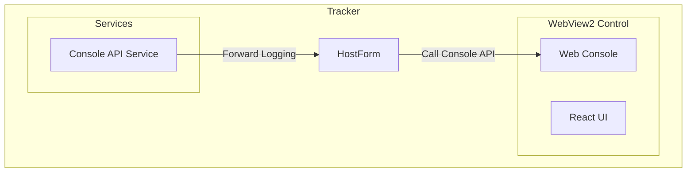
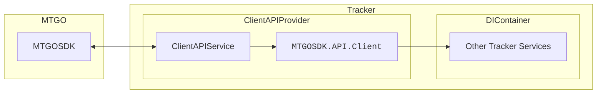
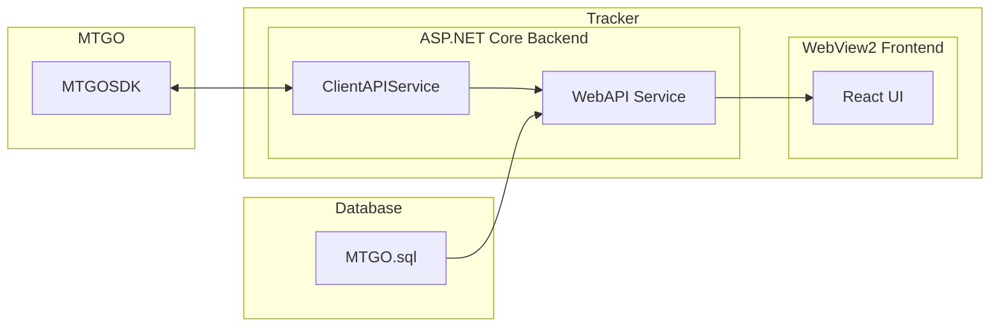
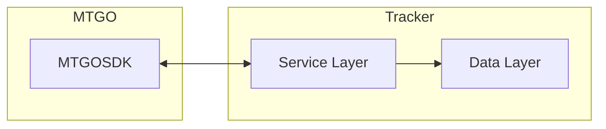
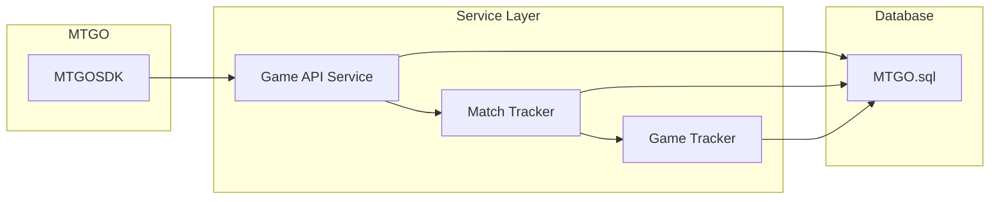
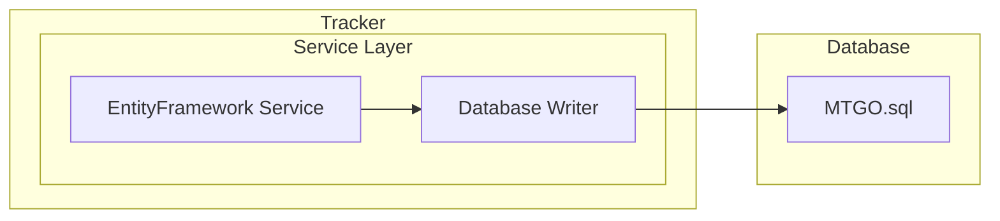
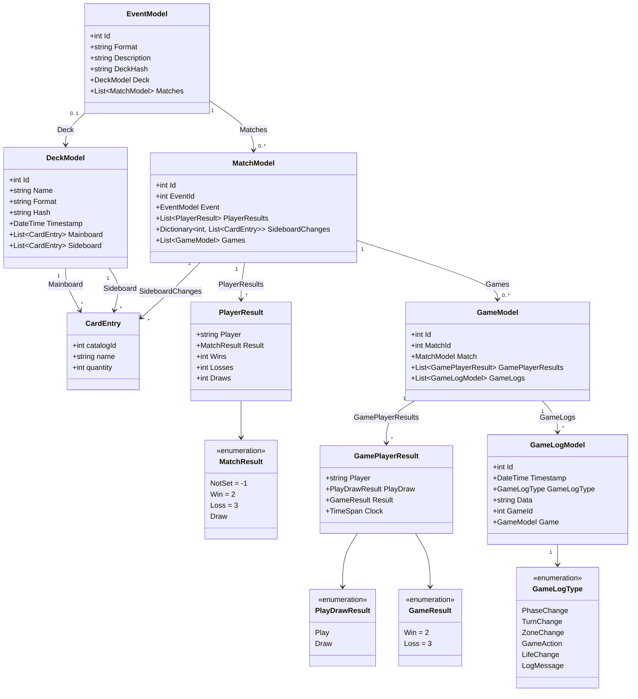
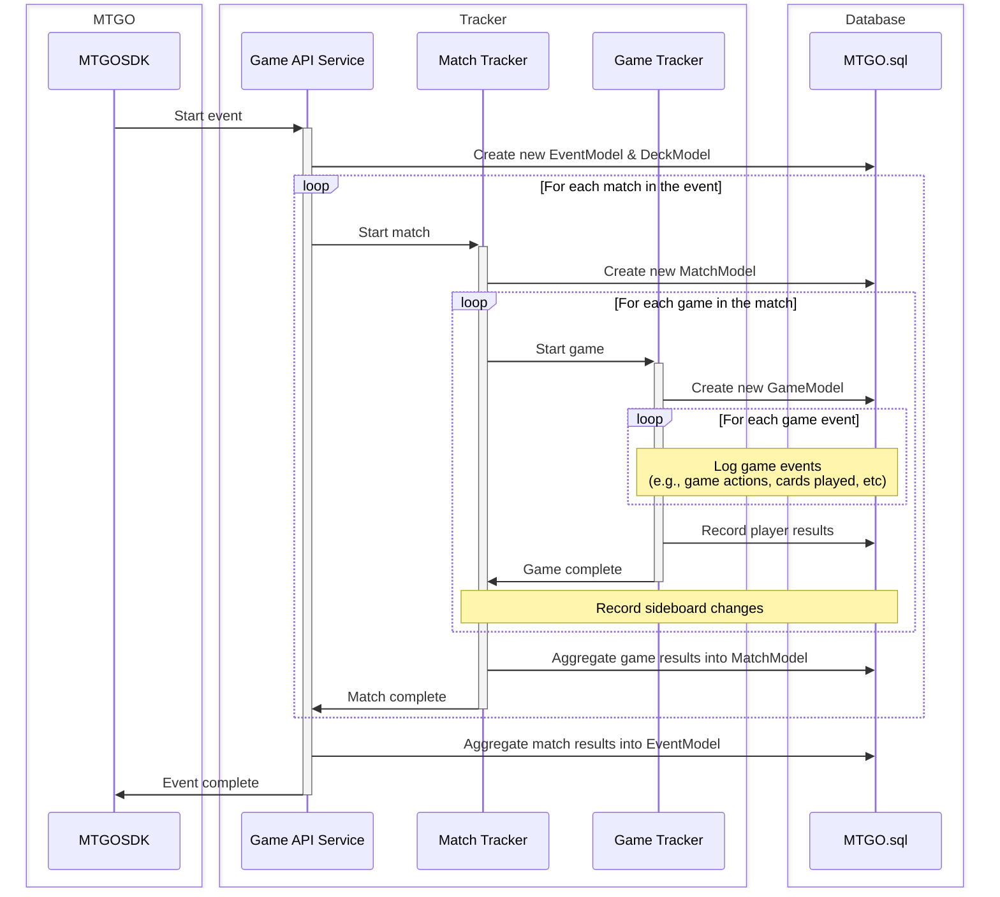
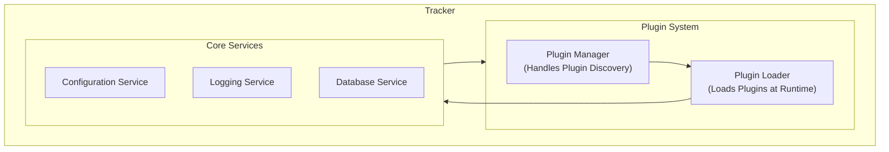

# Videre Tracker Architecture

This document describes the architecture of the Videre Tracker, a real-time data tracking and analytics application for Magic: The Gathering Online (MTGO). It outlines the core components, data processing pipeline, and extensibility features that enable robust gameplay tracking and analysis.

## 1. Overview

The Tracker is built on the .NET platform, leveraging ASP.NET Core for the backend API, Entity Framework Core for data access, and a modern React-based frontend hosted in a WebView2 control. This combination provides a responsive user experience while maintaining robust backend capabilities.

The application architecture follows a layered approach with clear separation of concerns between user interface, application infrastructure, and data tracking layers. This modular design allows for easy maintenance, extensibility, and scalability of tracker services as new features or data sources are added.

----

## 2. Core Application Components

Before describing the game tracking pipeline, it’s important to introduce the core infrastructure of the Tracker: the HostForm/WebView2 component, the ClientAPIProvider/ClientAPIService, and the WebAPI service. These subsystems underpin the user experience, enable robust runtime operations, and provide the integration point between UI, MTGO, and the backend services that populate the database.

### 2.1 HostForm & WebView2 (UI Host and Logging Bridge)

The HostForm is the native Windows Forms application window that manages the embedded WebView2 control, providing the bridge between the Tracker's backend and its modern frontend user interface.

- **WebView2 Hosting:** The HostForm instantiates and configures a WebView2 browser control, which renders the Tracker’s React-based UI in a native window frame. This setup allows for a highly dynamic and responsive frontend, allowing the UI to react to native Windows events.
- **C# ↔ JavaScript Interop:** A robust interop layer is provided between C# and JavaScript. HostForm exposes methods for executing JS, and receives events from the WebView2 DevTools Protocol (CDP) to facilitate two-way communication.
- **Console Integration:** All .NET logging is redirected to the in-app frontend console, allowing developers and users to view logs directly in the UI, including logs originating from C# code. This create a central sink for real-time logs and errors for better debugging and monitoring.

This component forms the main interface for interacting with the Tracker, and acts as the anchor point for all user-driven workflows.

### 2.2 ClientAPIService (MTGO Client Connection Management)

The ClientAPIService is responsible for the lifecycle management of the Tracker’s connection to the MTGO client using the MTGOSDK library. This subsystem ensures resilience in the face of MTGO crashes, restarts, or connection interruptions, supporting seamless user experience.

- **Connection Management:** The ClientAPIProvider encapsulates all logic required to connect, reconnect, and manage the underlying MTGO process. It registers a provider as a singleton dependency for the application, making the current MTGO client instance available to all dependent services. On process restarts or unexpected crashes, it automatically detects, disposes, and re-initializes without user intervention.
- **Crash Recovery Middleware:** The ClientAPIService injects ASP.NET Core middleware to catch exceptions (such as MTGO process crashes) during API requests. If a crash is detected mid-request, the middleware attempts to transparently re-initialize the MTGO client connection and retry the request, providing high availability.
- **Notification of Dependents:** When connection state changes (e.g., MTGO restarts), all dependent services are notified and can resynchronize their state with the new client instance, allowing features such as real-time event streaming or player state monitoring to recover without application restarts.

This design makes the Tracker robust against instability in the MTGO client, and ensures that backend services and UI components always interact with a valid, current MTGO connection.

### 2.3 WebAPI Service (Backend API for UI and Third-Party Apps)

The WebAPI service hosts the Tracker’s backend HTTP API, acting as the primary interface for the frontend UI and any external integrations.

- **ASP.NET Core Web Host:** The application launches an ASP.NET Core server in a background thread, exposing RESTful endpoints for all UI queries and interactions with the Tracker backend.
- **Customizable API Surface:** Endpoints are provided for querying event data, submitting actions, streaming live updates, and more. These APIs are optimized for both traditional request/response and event streaming (NDJSON, Server-Sent Events).
- **Frontend Integration:** The React UI, running inside the WebView2 control, communicates with this backend API for all gameplay data, statistics, and real-time updates. This separation allows for a clean, decoupled architecture and supports future integrations (e.g., plugins, analytics dashboards, external clients).

Together, these core application components provide the backbone for Tracker’s runtime: maintaining a resilient live connection to MTGO, surfacing data to the frontend, handling user interactions, and ensuring that all dependent services operate reliably in the face of client disruptions.

----

## 3. Game Tracking and Data Pipeline

This section describes the core tracking and data processing pipeline responsible for capturing, processing, and storing gameplay events.

The application is composed of three primary layers that work together to process data from the MTGO client and store it in the database.

* **MTGOSDK Layer (Data Acquisition):** This is the interface with the MTGO client. Using the `MTGOSDK` library, it connects to the client, subscribes to game state notifications (matches, games, actions), and provides the raw data for processing.
* **Service Layer (Data Processing):** This layer contains the core logic of the application. Specialized services transform the raw event data from the SDK into structured models.
* **Data Layer (Data Storage):** This layer is responsible for persisting the processed data. It uses Entity Framework Core to manage the database schema, handle transactions, and ensure data integrity.

### 3.1 MTGOSDK Layer

This layer serves as the interface between the Tracker application and the MTGO client. It leverages the MTGOSDK library to:

- Establish and maintain a connection with the MTGO client
- Subscribe to game events and state changes
- Receive notifications about matches, games, and in-game actions
- Provide access to MTGO's internal object model and state

The SDK layer provides a clean abstraction over the complexity of the MTGO client, allowing our application to focus on data processing rather than the intricacies of interfacing with the client. More details about MTGOSDK can be found in the [MTGOSDK documentation](https://github.com/videre-project/MTGOSDK/blob/main/docs/architecture/README.md).

### 3.2 Service Layer

The service contains specialized components to orchestrate the data flow of events from the MTGOSDK to the database. It is designed to handle the hierarchical nature of MTGO events (where an event can contain multiple matches, games, etc.) and to efficiently process large volumes of data in a structured manner.

The service layer is composed of several key components:

* **Game API Service:** Listens for the start and end of a complete event (e.g., a tournament), and manages the overall event tracking lifecycle.
* **Match Tracker:** Tracks player pairings, handles sideboarding between games, and delegates the detailed tracking of each game to the Game Tracker.
* **Game Tracker:** Subscribes to detailed in-game events (e.g., cards played, life total changes), records them as logs, and determines the final outcome of a single game. It uses an efficient producer/consumer pattern to batch-process these events.

Each service is responsible for a specific scope of the game data hierarchy and works together to ensure comprehensive data collection at all levels.

### 3.3 Data Layer

Create a diagram that shows a databasewriter + database service connecting to the database (MTGO.sql) and the service layer.

The data layer is responsible for persisting the processed game data into a structured database. It consists of:

- Entity Framework Core context and model definitions
- Database migrations and schema management
- Transaction handling and data integrity enforcement

The data layer uses a relational database schema that mirrors the hierarchical nature of MTGO events, allowing for efficient storage and querying of game data at various levels of granularity.

Below is a simplified class diagram of these database models:

The tracker maintains data integrity throughout the system through the use of:

- **Schema Constraints:** Foreign keys and validation rules enforce relationships between events, matches, games, and log entries.
- **Transactional Updates:** All critical updates use transactions to ensure consistency.
- **Hierarchical Validation:** Each layer checks that data is correctly linked and ordered (e.g., games to matches, logs to games).
- **Periodic Checks:** The database automatically schedules jobs to verify data consistency and clean up incomplete records.
- **Audit Trail:** Changes to all tables are logged for traceability and recovery.

These measures are put in place to ensure that the collected data is reliable and accurate for analysis purposes. In case of any issues, the tracker can recover gracefully, either by retrying operations or by reconstructing the state from the last known good snapshot.

----

## 4. Game Event Processing & Lifecycle

This system processes data in a hierarchical sequence, designed to capture events as soon as they occur. To minimize any potential sources of interruption, the tracker uses a producer/consumer pattern, where the MTGOSDK acts as the producer of game events, and the Game API Service, Match Tracker, and Game Tracker act as consumers that process these events asynchronously.

The following diagram illustrates this flow:

This begins with the MTGOSDK receiving and forwarding notifications from the MTGO client, which are then processed by the tracker's Game API Service. This service orchestrates the tracking of matches and games, ensuring that all relevant data is captured and stored in the database.

### 4.1 Event Lifecycle

We use these services to create a structured flow that captures the lifecycle of an MTGO event, from the initial game start to the final results being stored in the database. The key steps in this pipeline are:

1.  **Event Start:** The `GameAPIService` detects a new MTGO event, creating an `EventModel` and a corresponding `DeckModel` for the player's registered deck.
2.  **Match Start:** For each match, the service delegates to the `MatchTracker`, which creates a `MatchModel`.
3.  **Game Start:** The `MatchTracker` delegates to the `GameTracker` for each game in the match, which creates a `GameModel`.
4.  **Game Logging:** The `GameTracker` captures every game action and change to game state (e.g., zone changes, spells cast, life total changes) and creates `GameLogModel` entries for each.
5.  **Game End:** The `GameTracker` records the game's outcome.
6.  **Sideboarding:** Between games, the `MatchTracker` records any sideboard changes.
7.  **Match End:** The `MatchTracker` aggregates the results from the games to determine the match winner.
8.  **Event End:** The `GameAPIService` aggregates the results from all matches to finalize the `EventModel`.

### 4.2 Error Handling and Recovery

The Tracker ensures robust error handling and recovery mechanisms to maintain data integrity and minimize disruptions:

- **Connection Recovery:** Automatically reconnects to the MTGO client if the connection drops, with retries and health checks.
- **Transaction Safety:** Database operations are wrapped in transactions to prevent partial writes and ensure atomicity.
- **Event Queueing:** Game events are queued and batch-processed, allowing recovery from temporary failures without data loss.
- **State Validation:** Services validate incoming data and can reconstruct partial states if interrupted.
- **Logging:** Errors are logged for monitoring and troubleshooting.

----

## 5. Data Collection Details

### 5.1 Game Events Captured

The Tracker application captures a wide range of game events to provide comprehensive coverage of gameplay:

- **Phase Changes**: Transitions between game phases (untap, upkeep, draw, etc.)
- **Zone Changes**: Cards moving between zones (library, hand, battlefield, graveyard, etc.)
- **Life Changes**: Updates to player life totals
- **Mana Pool Changes**: Addition and expenditure of mana
- **Stack Actions**: Spells cast, abilities activated, and triggers placed on the stack
- **Card Targets**: Information about what targets were chosen for spells and abilities
- **Combat Actions**: Attackers, blockers, and damage assignment
- **Player Decisions**: Choices made in response to prompts and options

Each of these event types is stored with contextual information such as the turn number, phase, and player index, allowing for detailed reconstruction and analysis of gameplay.

### 5.2 Analytics Available

The comprehensive data collection enables a wide range of analytics:

- **Deck Performance**: Win rates, match statistics, and performance against different archetypes
- **Card Analysis**: Usage patterns, effectiveness, and impact on game outcomes
- **Game Metrics**: Average game length, turn count, and tempo indicators
- **Mana Efficiency**: Analysis of mana curve, color requirements, and casting costs
- **Sideboarding Effectiveness**: Impact of sideboard changes on game outcomes
- **Decision Points**: Analysis of critical decision points and their outcomes

These analytics can be used to improve deck construction, gameplay decisions, and overall strategy.

----

## 6. Extensibility

The Tracker is architected for extensibility at multiple levels, enabling new features, integrations, and analytics without modification to the core system. Extensibility is achieved through a plugin-friendly design leveraging C# interfaces, dependency injection, and a discoverable module structure.

### 6.1 Plugin System Overview

<!-- Create a simple diagram that shows how plugins can be injected into the Tracker system. -->

To ensure a consistent and maintainable plugin architecture, this system is built around several key principles:

- **Interface-Based Contracts:** All extensible components (such as additional trackers, analytics modules, or data processors) must implement well-defined C# interfaces. This allows the core application to discover and interact with plugins in a type-safe, version-tolerant way.
- **Plugin Discovery and Registration:** At startup, the application scans designated plugin directories for assemblies (DLLs) containing types that implement the relevant interfaces (e.g., `IGameEventTracker`, `IAnalyticsModule`, etc.).
  - Reflection and convention-based loading are used for hooking into the application's services without recompilation, meaning plugins can be added or removed dynamically.
  - Discovered plugins are registered with the application's dependency injection container, enabling them to declare dependencies on core services such as configuration, logging, or database access.
- **Lifecycle Management:** Plugins implement interfaces (such as `IPlugin`) with lifecycle hooks (e.g., `Initialize(IServiceProvider)`, `Dispose()`). The host application then manages plugin initialization, dependency injection, and teardown.
  - Plugins can subscribe to domain events (such as game state changes or user actions) using strongly-typed event interfaces to observe, augment, or respond to core workflows.
  - By relying on interfaces and serialization contracts, the system can support backward and forward compatibility for plugins across tracker upgrades.

The plugin model makes it easy for the community to develop and share new features, analytics modules, or data integrations, accelerating the Tracker’s evolution.

### 6.2 Examples of Extensible Components

- **Game Event Trackers:** Custom trackers can be implemented to capture additional game events or specialized data (e.g., custom formats, alternative game modes). These trackers can subscribe to the core event stream and process data in real-time.
- **Analytics Modules:** New analytics can be added to compute additional statistics or insights from the game data. These modules can register themselves to receive game events and perform calculations, storing results in the database or exposing them via the API.
- **Data Exporters:** Plugins can implement data exporters to transform and export game data into different formats (e.g., CSV, JSON, XML) or integrate with external systems (e.g., analytics platforms, cloud storage).
- **UI Enhancements:** Additional UI components or pages can be developed as plugins, allowing for custom visualizations, dashboards, or user workflows that leverage the core game data without modifying the main application.

This extensibility model ensures that the Tracker can evolve rapidly, support specialized workflows, and integrate with new MTGO features or user needs without compromising the stability or maintainability of the core system.
